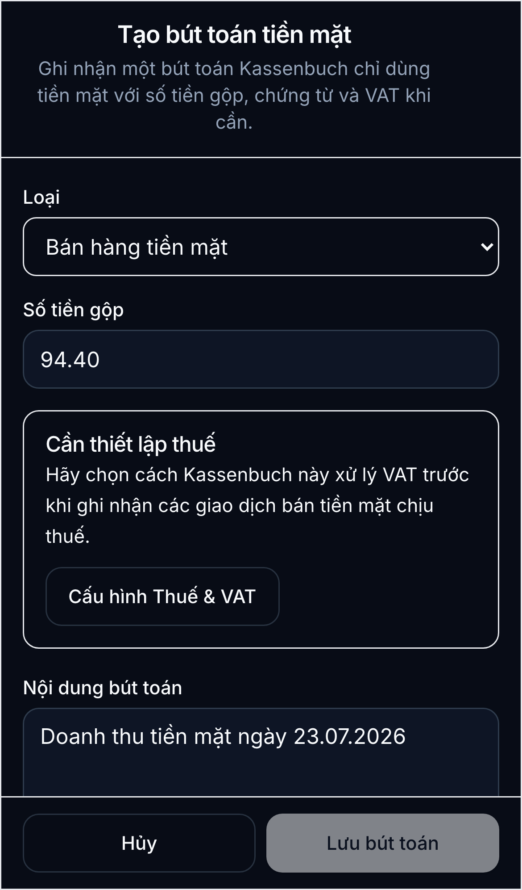
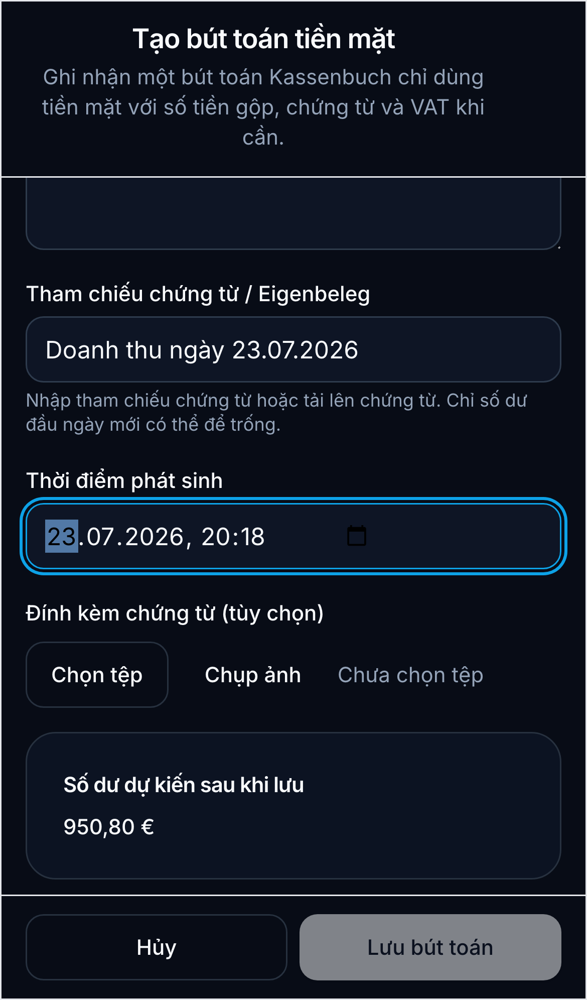

# Ghi doanh thu tiền mặt

Hướng dẫn này dùng để ghi một khoản **tiền khách trả bằng tiền mặt** vào quầy thu. Ví dụ: doanh thu ngày 23.07 là **94,40 EUR**.

## Khi nào dùng

- Dùng loại **Bán hàng tiền mặt** (`SALE_CASH`) khi tiền của khách được nhận trực tiếp tại quầy.
- Không dùng loại này cho tiền cá nhân bỏ vào quầy (`Privateinlage`) hoặc tiền chuyển từ quầy vào ngân hàng.
- Không tạo lại giao dịch nếu doanh thu đã có trong danh sách. Khoản **94,40 EUR ngày 23.07.2026** đã được ghi nhận trong quầy `Chính`.

## Các bước trên điện thoại

1. Mở **Quầy thu** và chọn quầy **Chính**.
2. Chạm **Bút toán mới** để mở danh sách bút toán. Trên màn hình danh sách, chạm **Bút toán mới** một lần nữa.
3. Trong trường **Loại**, chọn **Bán hàng tiền mặt**.
4. Nhập **Số tiền gộp**. Với ví dụ này, nhập `94.40`; sau khi lưu, hệ thống hiển thị `94,40 EUR`.
5. Chọn **Mã VAT** đúng theo hóa đơn. Nếu màn hình hiện **Cần thiết lập thuế**, chạm **Cấu hình Thuế & VAT** và hoàn tất thiết lập trước khi lưu doanh thu.

6. Điền **Nội dung bút toán**, ví dụ: `Doanh thu tiền mặt ngày 23.07.2026`.
7. Nhập số hóa đơn/chứng từ ở **Tham chiếu chứng từ / Eigenbeleg**, hoặc chụp/tải chứng từ nếu có.
8. Điền **Thời điểm phát sinh** bằng thời điểm tiền thực tế được nhận. Với ví dụ này, chọn ngày `23.07.2026`.

9. Kiểm tra **Số dư dự kiến sau khi lưu**, rồi chạm **Lưu bút toán**.

## Kiểm tra sau khi lưu

- Giao dịch phải hiện là **Bán hàng tiền mặt** và được ghi nhận là **thu**.
- Số tiền gộp phải là `94,40 EUR`.
- Ngày và nội dung bút toán phải khớp với doanh thu thực tế.
- Số dư quầy tăng đúng bằng số tiền ghi nhận.

## Lưu ý với ngày đã chốt

Sau khi một ngày đã được chốt, hệ thống không cho thêm trực tiếp doanh thu tiền mặt vào ngày đó. Không tạo giao dịch trùng lặp hoặc sửa trực tiếp số dư. Hãy dùng quy trình **Điều chỉnh** có lý do rõ ràng, hoặc liên hệ người quản lý sổ quỹ để mở lại quy trình phù hợp.

## Phân biệt với Privateinlage

Khoản **30,00 EUR Privateinlage** để làm tiền thối cho khách không phải doanh thu. Khoản này phải dùng loại **Privateinlage - tiền cá nhân bỏ vào quỹ**, không dùng **Bán hàng tiền mặt**.
