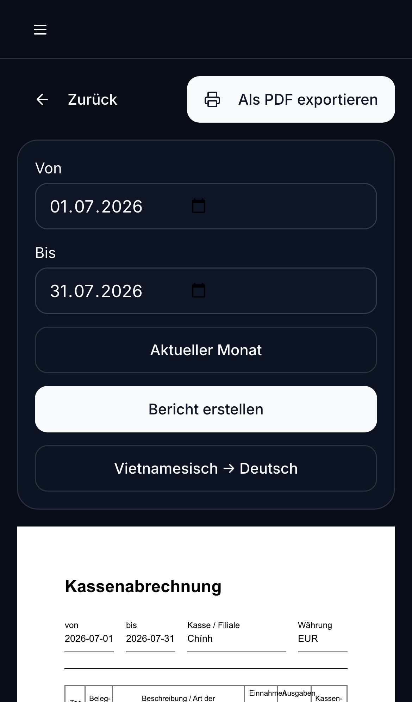
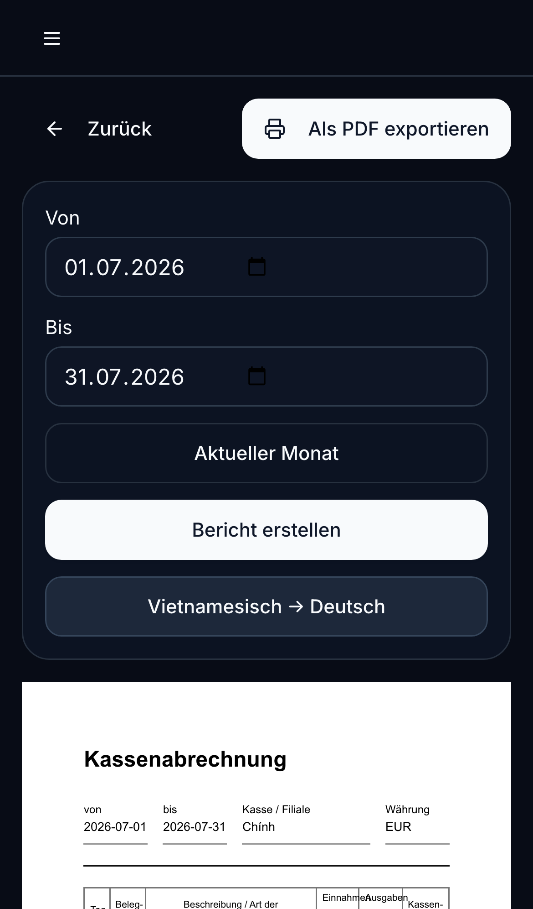

# Tạo Kassenabrechnung tháng 7 và dịch sang tiếng Đức

Hướng dẫn này dùng để mở báo cáo quầy thu cho tháng 7.2026, kiểm tra các bút toán và dịch nội dung tiếng Việt sang tiếng Đức.

## Các bước trên điện thoại

1. Mở **Quầy thu** và chọn quầy **Chính**.
2. Chạm **Kassenabrechnung**.
3. Trong **Von**, chọn `01.07.2026`.
4. Trong **Bis**, chọn `31.07.2026`.
5. Chạm **Bericht erstellen** để tạo báo cáo.

6. Kiểm tra kỳ báo cáo, tên quầy, tiền thu, tiền chi và số dư.
7. Chạm **Vietnamesisch → Deutsch** để dịch phần nội dung giao dịch sang tiếng Đức.
8. Kiểm tra lại bản dịch. Ngày và số tiền không thay đổi.
9. Chạm **Als PDF exportieren** nếu cần lưu hoặc gửi báo cáo PDF.

## Kiểm tra trước khi xuất PDF

- Kỳ báo cáo phải là `01.07.2026 - 31.07.2026`.
- Tên quầy phải là **Chính** và tiền tệ là **EUR**.
- Doanh thu tiền mặt, Privateinlage và khoản nộp vào ngân hàng phải nằm đúng nhóm.
- Tổng cuối kỳ phải khớp với số dư quầy thực tế.
- Nếu thấy giao dịch trùng hoặc sai loại, không sửa số dư bằng tay; hãy xử lý giao dịch sai trước khi xuất bản chính thức.
