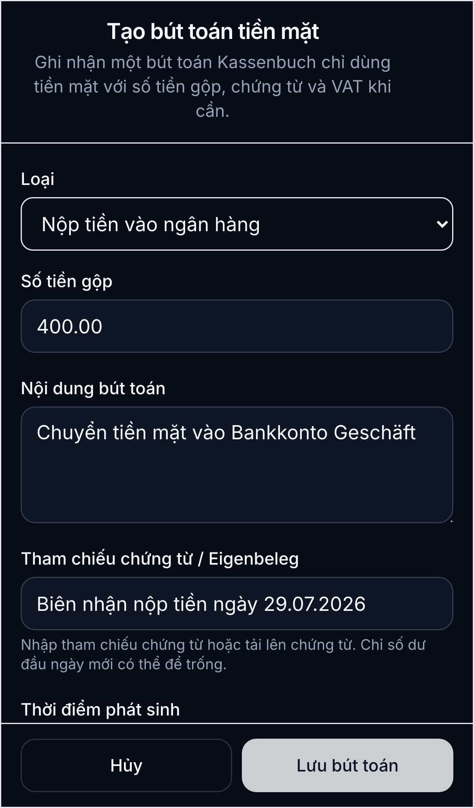
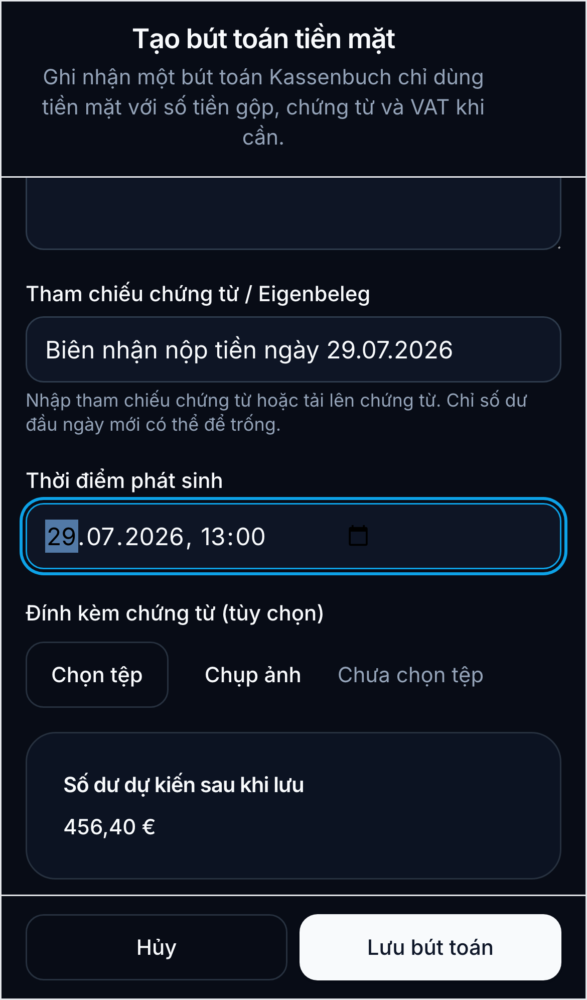

# Nộp tiền mặt từ quầy vào tài khoản ngân hàng

Hướng dẫn này dùng khi mang tiền mặt từ quầy thu đi nộp vào tài khoản ngân hàng của doanh nghiệp. Ví dụ: chuyển **400,00 EUR** vào `Bankkonto Geschäft` ngày 29.07.2026.

## Khi nào dùng

- Dùng loại **Nộp tiền vào ngân hàng** (`BANK_DEPOSIT`) khi tiền rời khỏi quầy thu để vào tài khoản ngân hàng doanh nghiệp.
- Đây là giao dịch **chi từ quầy**: số dư tiền mặt giảm, nhưng không phải là chi phí.
- Không dùng **Chi tiền mặt**, **Privatentnahme**, hoặc **Điều chỉnh** cho một khoản nộp tiền vào ngân hàng.

## Các bước trên điện thoại

1. Mở **Quầy thu** và chọn quầy cần nộp tiền, ví dụ quầy **Chính**.
2. Chạm **Bút toán mới** để mở danh sách bút toán. Trên màn hình danh sách, chạm **Bút toán mới** một lần nữa.
3. Trong trường **Loại**, chọn **Nộp tiền vào ngân hàng**.
4. Nhập **Số tiền gộp**. Với ví dụ này, nhập `400.00`; sau khi lưu, hệ thống hiển thị `400,00 EUR`.
5. Nhập **Nội dung bút toán** rõ ràng, ví dụ: `Chuyển tiền mặt vào Bankkonto Geschäft`.

6. Trong **Tham chiếu chứng từ / Eigenbeleg**, ghi mã biên nhận nộp tiền, tên ngân hàng hoặc tham chiếu giao dịch.
7. Chọn **Thời điểm phát sinh** là thời điểm thực tế nộp tiền vào ngân hàng, ví dụ `29.07.2026`.
8. Chụp/tải biên nhận nộp tiền nếu có.

9. Kiểm tra **Số dư dự kiến sau khi lưu**. Số dư tiền mặt phải giảm `400,00 EUR`.
10. Chạm **Lưu bút toán**.

## Kiểm tra sau khi lưu

- Giao dịch phải hiện là **Nộp tiền vào ngân hàng**.
- Khoản `400,00 EUR` phải hiển thị ở cột **chi/ra khỏi quầy**.
- Số dư tiền mặt giảm đúng `400,00 EUR`.
- Giao dịch ngân hàng thực tế phải khớp về số tiền, ngày và biên nhận.

## Lưu ý quan trọng

- Giao dịch nộp tiền vào ngân hàng không làm doanh thu tăng hoặc giảm; nó chỉ chuyển tiền từ quầy sang ngân hàng.
- Không thể thêm trực tiếp giao dịch vào một ngày đã chốt. Nếu đã chốt ngày, dùng quy trình **Điều chỉnh** có lý do và chứng từ.
- Nếu đã tạo nhầm giao dịch, không sửa số dư bằng tay. Hãy đảo giao dịch với lý do có thể kiểm tra, rồi tạo lại giao dịch đúng.
