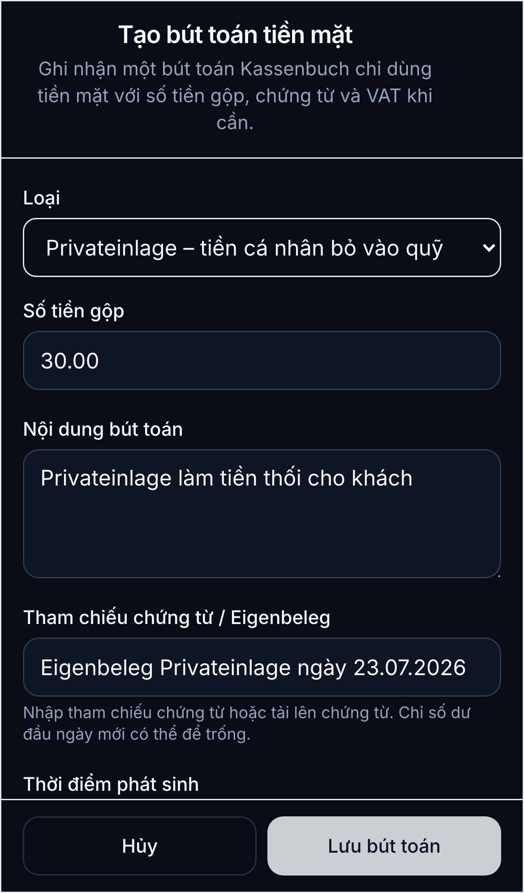
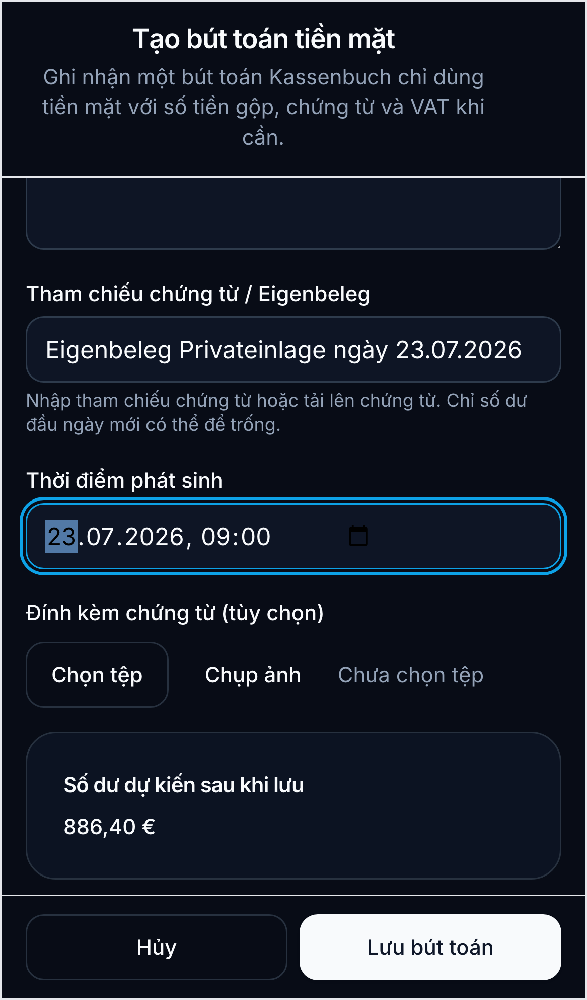

# Bỏ tiền cá nhân vào quầy làm tiền thối (Privateinlage)

Hướng dẫn này dùng khi chủ cửa hàng bỏ tiền cá nhân vào quầy thu. Ví dụ: ngày 23.07.2026 bỏ **30,00 EUR** vào quầy để có tiền thối cho khách.

## Khi nào dùng

- Chọn **Privateinlage - tiền cá nhân bỏ vào quỹ** (`OWNER_DEPOSIT`).
- Khoản này làm số dư quầy tăng nhưng **không phải doanh thu**.
- Không chọn **Bán hàng tiền mặt**, vì tiền không đến từ khách hàng.

## Các bước trên điện thoại

1. Mở **Quầy thu** và chọn quầy **Chính**.
2. Chạm **Bút toán mới** để mở danh sách bút toán, rồi chạm **Bút toán mới** một lần nữa.
3. Trong trường **Loại**, chọn **Privateinlage - tiền cá nhân bỏ vào quỹ**.
4. Nhập **Số tiền gộp** là `30.00`; sau khi lưu, hệ thống hiển thị `30,00 EUR`.
5. Nhập **Nội dung bút toán**, ví dụ: `Privateinlage làm tiền thối cho khách`.

6. Tạo Eigenbeleg và nhập tham chiếu, ví dụ: `Eigenbeleg Privateinlage ngày 23.07.2026`.
7. Chọn **Thời điểm phát sinh** đúng lúc tiền được bỏ vào quầy, ví dụ ngày `23.07.2026`.
8. Có thể chụp hoặc tải Eigenbeleg lên làm chứng từ.

9. Kiểm tra số dư dự kiến tăng `30,00 EUR`, rồi chạm **Lưu bút toán**.

## Kiểm tra sau khi lưu

- Giao dịch phải hiện là **Privateinlage - tiền cá nhân bỏ vào quỹ**.
- Số dư tiền mặt tăng đúng `30,00 EUR`.
- Doanh thu ngày không tăng thêm `30,00 EUR`.
- Ngày, nội dung và Eigenbeleg phải khớp với việc bỏ tiền thực tế.

## Tránh nhầm loại giao dịch

- Tiền khách thanh toán: dùng **Bán hàng tiền mặt**.
- Tiền cá nhân bỏ vào quầy: dùng **Privateinlage**.
- Tiền lấy từ quầy cho mục đích cá nhân: dùng **Privatentnahme**.
- Tiền mang từ quầy nộp vào tài khoản doanh nghiệp: dùng **Nộp tiền vào ngân hàng**.
